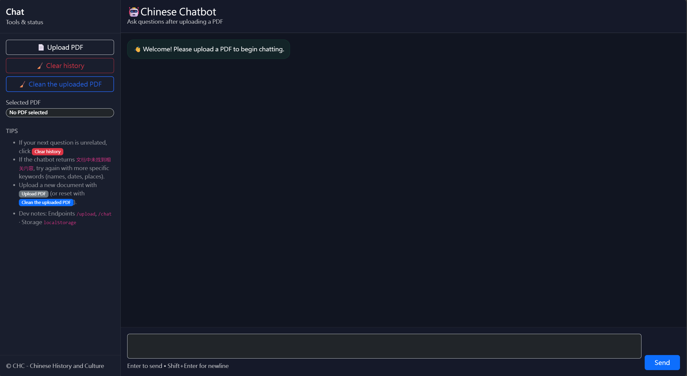

# 🤖 PDF Chat (RAG) — FastAPI + Chroma + Ollama

[](https://www.python.org/)
[](https://fastapi.tiangolo.com/)
[](#license)

Upload a PDF and chat with it using Retrieval-Augmented Generation (RAG).  
Runs locally with a FastAPI backend and a simple web UI.

## UI


## Upload


## Chat


---

## ✨ Features
- Web UI: upload PDF → ask questions → clear/reset
- Per-PDF persistent vector store (Chroma)
- Chinese prompt + chat history injection (history is not used for retrieval)
- OCR fallback for scanned PDFs

---

## 🧠 How it works (high level)
1. **Upload** PDF → saved to `uploads/`
2. **Extract text** via PyMuPDF  
   - If almost no text is extracted → **OCR fallback** (optional)
3. **Chunk + embed** → stored in `chroma_dbs/<file_id>/`
4. **Chat** endpoint retrieves top-K chunks and calls Ollama LLM

---

## 🧱 Tech Stack
- **Backend:** FastAPI (Python)
- **Vector DB:** Chroma
- **Embeddings:** Local HuggingFace model (example: `bge-large-zh-v1.5`)
- **LLM:** Ollama (example model: `deepseek-r1:14b`)
- **Frontend:** Static HTML/CSS/JS in `static/`

---

## 📁 Project Structure
```txt
.
├── app.py
├── static/
│   ├── index.html
│   ├── app.js
│   └── style.css
├── uploads/        # runtime (ignored by git)
├── extracted/      # runtime (ignored by git)
└── chroma_dbs/     # runtime (ignored by git)

```

---

# 📋 Requirements
## Required

### 🐍 Python 3.10+
- [](https://www.python.org/downloads/) — Download and install the latest version of Python 3.10 or higher.

### 🦙 Ollama (LLM Runtime)

- [](https://ollama.com/download) — Install Ollama for local LLM execution.
- [](https://github.com/ollama/ollama) — Explore the official documentation.

## Embedding model

This repo expects a local embedding model folder, default:
```
./bge-large-zh-v1.5
```
### 🧩 Model: BAAI bge-large-zh-v1.5
- [](https://huggingface.co/BAAI/bge-large-zh-v1.5) — Reference and download page

## OCR Optional (only if you need OCR for scanned PDFs)

### 🔍 Tesseract OCR
- [](https://github.com/UB-Mannheim/tesseract/wiki) — Windows installer (UB Mannheim build)  
- [](https://tesseract-ocr.github.io/) — Official documentation

### 📄 Poppler (for pdf2image)

- [](https://github.com/oschwartz10612/poppler-windows) — Windows builds  
- [-silver?style=for-the-badge&logo=apple)](https://brew.sh/) — Install via Homebrew: `brew install poppler`
- [](#) — Install via your distro package manager (e.g., `apt install poppler-utils`)

---

# 🚀 Setup
## 1) Create a virtual environment
```
python -m venv .venv
# Windows:
.venv\Scripts\activate
# macOS/Linux:
source .venv/bin/activate
```

## 2) Install Python dependencies

If you have requirements.txt, use it:
```
pip install -r requirements.txt
```

If you don’t, install the common deps:
```
pip install fastapi uvicorn pydantic chromadb PyMuPDF \
  langchain-core langchain-community langchain-text-splitters \
  langchain-huggingface langchain-chroma langchain-ollama
```

Optional OCR deps:
```
pip install pdf2image pytesseract pillow
```

## 3) Make sure Ollama has the model

Default model used by the app: deepseek-r1:14b
```
ollama pull deepseek-r1:14b
```

(Or choose another model and set OLLAMA_MODEL—see config below.)

## 4) Embedding model folder

By default the app looks for:
```
./bge-large-zh-v1.5
```
If your embedding model lives somewhere else, set:

## macOS/Linux
```
export EMBED_MODEL_PATH="/path/to/bge-large-zh-v1.5"
```
## Windows PowerShell
```
setx EMBED_MODEL_PATH "C:\path\to\bge-large-zh-v1.5"
```
## Run the App

From the project root:
```
uvicorn app:app --reload --port 8000
```

Open:
```
http://127.0.0.1:8000
```

---

## ⚙️ Configuration (Environment Variables)

These are variables in `app.py`:

| Variable           | Default                                        | Description                       |
| ------------------ | ---------------------------------------------- | --------------------------------- |
| `EMBED_MODEL_PATH` | `./bge-large-zh-v1.5`                          | Local embedding model directory   |
| `OLLAMA_MODEL`     | `deepseek-r1:14b`                              | Ollama model name                 |
| `CHUNK_SIZE`       | `600`                                          | Chunk size for indexing           |
| `CHUNK_OVERLAP`    | `100`                                          | Chunk overlap                     |
| `TOP_K`            | `5`                                            | Retrieved chunks per question     |
| `OCR_LANG`         | `chi_tra`                                      | Tesseract language code           |
| `OCR_DPI`          | `200`                                          | OCR render DPI                    |
| `POPPLER_PATH`     | (auto-detect if bundled)                       | Path to Poppler `bin` (for OCR)   |
| `TESSERACT_CMD`    | `C:\Program Files\Tesseract-OCR\tesseract.exe` | Path to `tesseract.exe` (Windows) |
| `TESSDATA_PREFIX`  | `C:\Program Files\Tesseract-OCR\tessdata`      | Path to tessdata folder (Windows) |

---

## 🧾 OCR Notes

OCR runs only if **PyMuPDF** extracts almost no text (typical for scanned PDFs).

### ⚙️ Windows Defaults
By default, `app.py` points to:
- `C:\Program Files\Tesseract-OCR\tesseract.exe`
- `C:\Program Files\Tesseract-OCR\tessdata`

If your installation paths differ, update the constants in `app.py`:
- `TESSERACT_CMD`
- `TESSDATA_PREFIX`

### 🌐 Language Data
- [](https://github.com/tesseract-ocr/tessdata) — Reference for language files (e.g., `chi_tra`)

### 💻 macOS / Linux
If you’re on macOS or Linux, update the constants in `app.py` or set your environment variables accordingly.

---

# 📡 API Endpoints

| Method | Path      | Description                           |
| ------ | --------- | ------------------------------------- |
| `POST` | `/upload` | Upload a PDF and build an index       |
| `POST` | `/chat`   | Ask questions using retrieved context |
| `POST` | `/clear`  | Clear chat and remove current data    |
| `GET`  | `/`       | Frontend                              |

## 📤 POST /upload

Upload a PDF (multipart/form-data with field name file).

**Example:**
```
curl -F "file=@your.pdf" http://127.0.0.1:8000/upload
```

**Returns:**
```
{ "ok": true, "name": "your.pdf", "id": "abcdef123456" }
```

## 💬 POST /chat

**Send messages:**
```
curl -X POST http://127.0.0.1:8000/chat \
  -H "Content-Type: application/json" \
  -d '{"messages":[{"role":"user","content":"What is this PDF about?"}]}'
```

**Returns:**
```
{ "reply": "..." }
```

## 🧹 POST /clear

Clears current PDF + deletes its stored files/vectors

**Example:**
```
curl -X POST http://127.0.0.1:8000/clear
```

---

# 🛠️ Troubleshooting

“No PDF indexed yet. Upload a PDF first.”
Upload a PDF via the UI or POST /upload before chatting.

OCR errors / “OCR dependencies are missing…”
Install pytesseract and pdf2image, and ensure Tesseract + Poppler are installed/available.

Large PDF indexing is slow
That’s normal. Try smaller PDFs first or reduce CHUNK_SIZE/TOP_K.

### Make Tesseract paths configurable (Windows)

If your machine doesn’t have Tesseract installed in the same location, you can switch the hard-coded paths to environment variables:

```py
TESSERACT_CMD = os.getenv("TESSERACT_CMD", "")
TESSDATA_PREFIX = os.getenv("TESSDATA_PREFIX", "")

if TESSDATA_PREFIX:
    os.environ["TESSDATA_PREFIX"] = TESSDATA_PREFIX
```

Example `.env`:
```
TESSERACT_CMD=C:\Program Files\Tesseract-OCR\tesseract.exe
TESSDATA_PREFIX=C:\Program Files\Tesseract-OCR\tessdata
```

---

# 🛡️ Security Notes

This app accepts file uploads and runs a local LLM workflow. If you deploy it beyond localhost, add authentication and restrict file handling.

# 📜 License
MIT License. See `LICENSE`.


